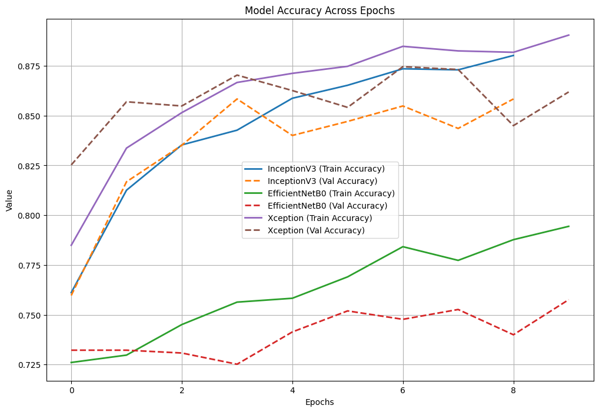

## DefectDetection

### Overview  
This program is designed to spot defects in steel sheets using deep learning techniques.This is a classification problem by trying to find the class[1, 2, 3, 4] of defect based on the image captured. We’re working with a training dataset that includes 7,095 images, and we’re applying data augmentation to boost both the size and variety of this dataset. The project involves comparing different deep learning architectures, and we’ll be fine-tuning the selected model to enhance its performance.

### Contents  
1. Objective  
2. Dataset  
3. Data Augmentation  
4. Model Comparison  
5. Fine-tuning   
6. Results  

### Objective  
The main aim of this project is to create a deep learning model that can accurately identify defects in steel sheets. We’ll train the model using a relatively small available dataset of 7,095 labeled images, employing techniques like data augmentation, model comparison, and fine-tuning to improve its accuracy.

### Dataset  
Our dataset is made up of 7,095 images of steel sheets, each labeled with the specific type of defect, the defect class range from 1 through 4. We’ll divide the dataset into training and validation sets. To prepare the images, we normalize the dataset by normalizing the pixel values (by dividing by 255). 

Dataset Source: https://www.kaggle.com/competitions/severstal-steel-defect-detection/data
_Notes: Please note that only limited image files were uploaded in the data, Use the kaggle data set for the entire data to run against the attached jupyter notebook_

### Data Augmentation
Due to the limited size of the dataset, data augmentation is applied to increase the size and diversity of the training data. Data augmentation applied are as follows:

*	__rescale=1./255:__ This step normalizes the pixel values by scaling them down to a range between 0 and 1.
*	__shear_range=0.2:__ It applies random shear transformations to the images, allowing for variations within a 0.2 range. 
*   __zoom_range=0.2:__ This feature randomly zooms in or out on the images, giving a variation of up to 20%.*  
*   __horizontal_flip=True:__ It randomly flips images horizontally to enhance augmentation. 
*   __vertical_flip=True:__ This option randomly flips images vertically for added variety. 
*   __brightness_range=[0.8, 1.2]:__ It adjusts the brightness of the images randomly, ranging from 80% to 120% of the original brightness.

### Model Comparison
The program compares multiple deep learning models to find the one that best performs on the steel defect detection task. Models tested include:
 * __InceptionV3__
 * __EfficientNetB0__
 * __Xception__


Each model is trained and evaluated using the same dataset, and accuracy performance metrics were used for comparison across each of the selected models.

 Model training accuracy and loss Stats
```
 Results for InceptionV3:
 * Training Accuracy: 0.8211768865585327
 * Validation Accuracy: 0.816067636013031
 * Training Loss: 0.42351657152175903
 * Validation Loss: 0.4630342125892639


Results for EfficientNetB0:
 * Training Accuracy: 0.724277675151825
 * Validation Accuracy: 0.7322058081626892
 * Training Loss: 0.8725362420082092
 * Validation Loss: 0.85508131980896


Results for Xception:
 * Training Accuracy: 0.8282241225242615
 * Validation Accuracy: 0.8379140496253967
 * Training Loss: 0.3997619152069092
 * Validation Loss: 0.42924144864082336
```


#### Fine-tuning
Applied the fine-tuning to improve the model's performance further. Fine-tuning consists of:
 * Unfreezing the deep learning models from layer = 50
 * Adjusting the learning rate = 0.0001
 * Early stopping

 Model Fine-tuning accuracy and loss Stats

```
 Results for InceptionV3:
 * Fine tuned Training Accuracy: 0.8801973462104797
 * Fine tuned Validation Accuracy: 0.858350932598114
 * Fine tuned Training Loss: 0.29150131344795227
 * Fine tuned Validation Loss: 0.3806813061237335

Results for EfficientNetB0:
 * Fine tuned Training Accuracy: 0.7943974733352661
 * Fine tuned Validation Accuracy: 0.7575757503509521
 * Fine tuned Training Loss: 0.48865455389022827
 * Fine tuned Validation Loss: 0.69825279712677


Results for Xception:
 * Fine tuned Training Accuracy: 0.8904157876968384
 * Fine tuned Validation Accuracy: 0.8618745803833008
 * Fine tuned Training Loss: 0.2580391466617584
 * Fine tuned Validation Loss: 0.3762108385562897
 ```
 


### Results
Of the three training models that we identified for training and fine-tuning, we found that deep learning Xception performed that best with respect to accuracy and loss.
